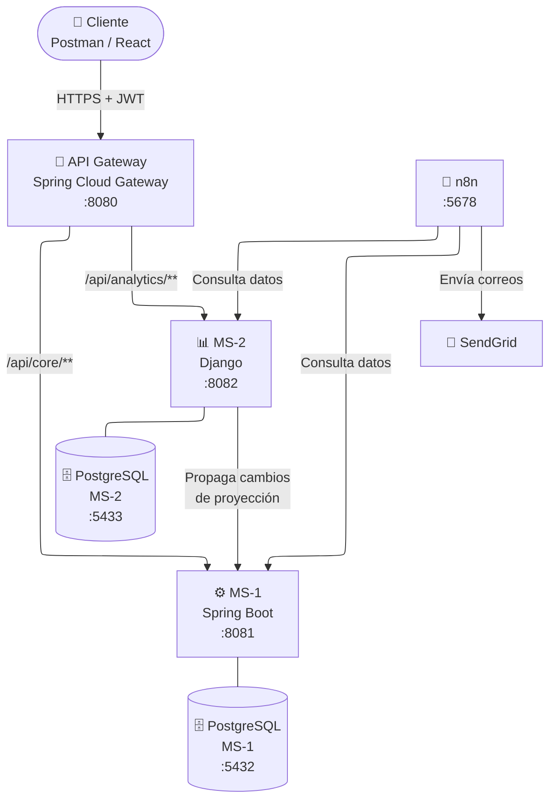
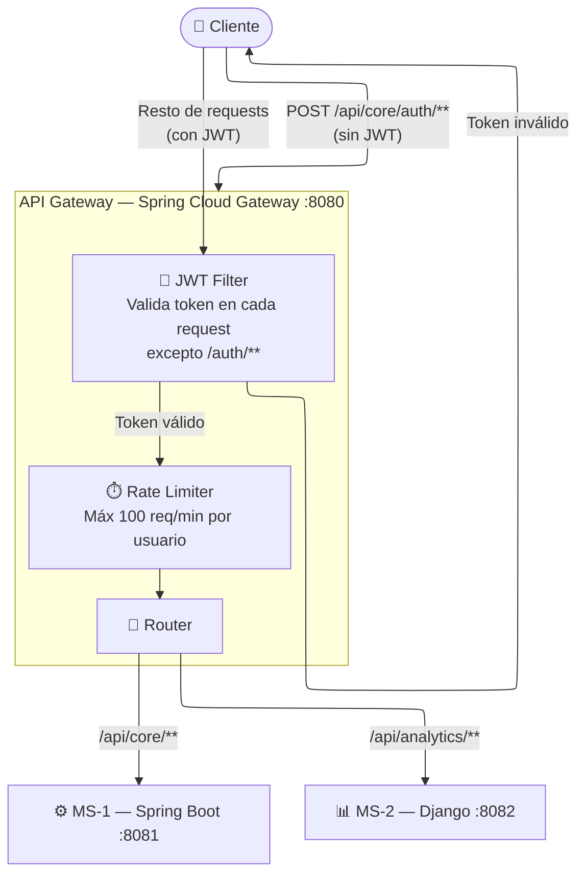
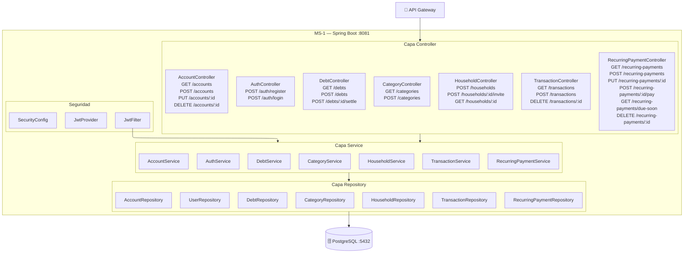
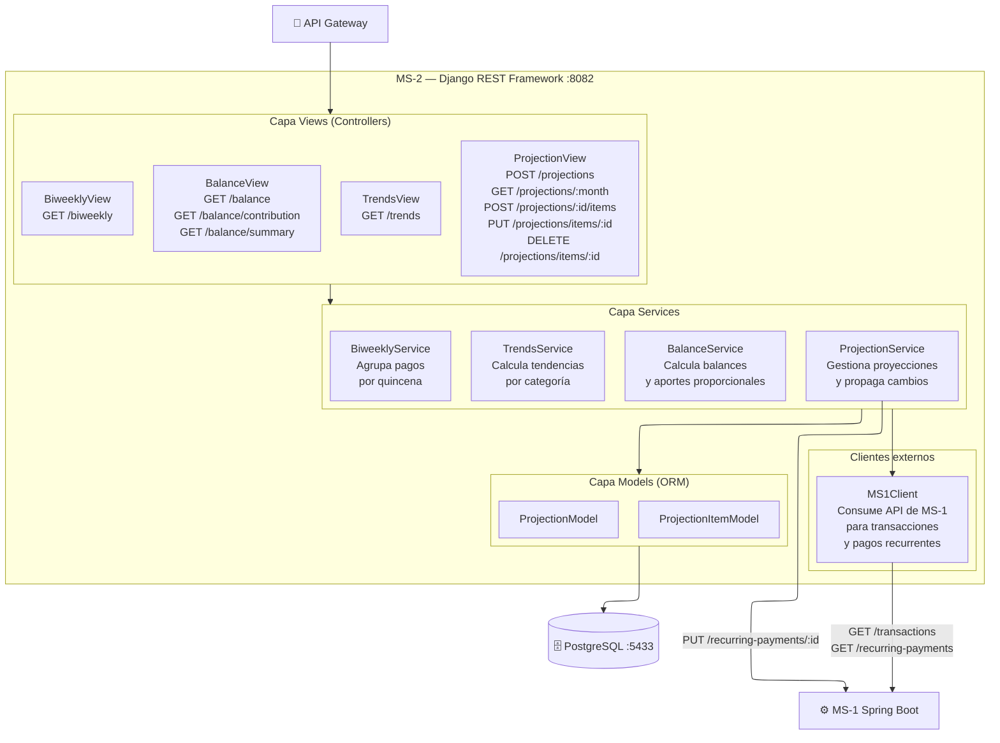
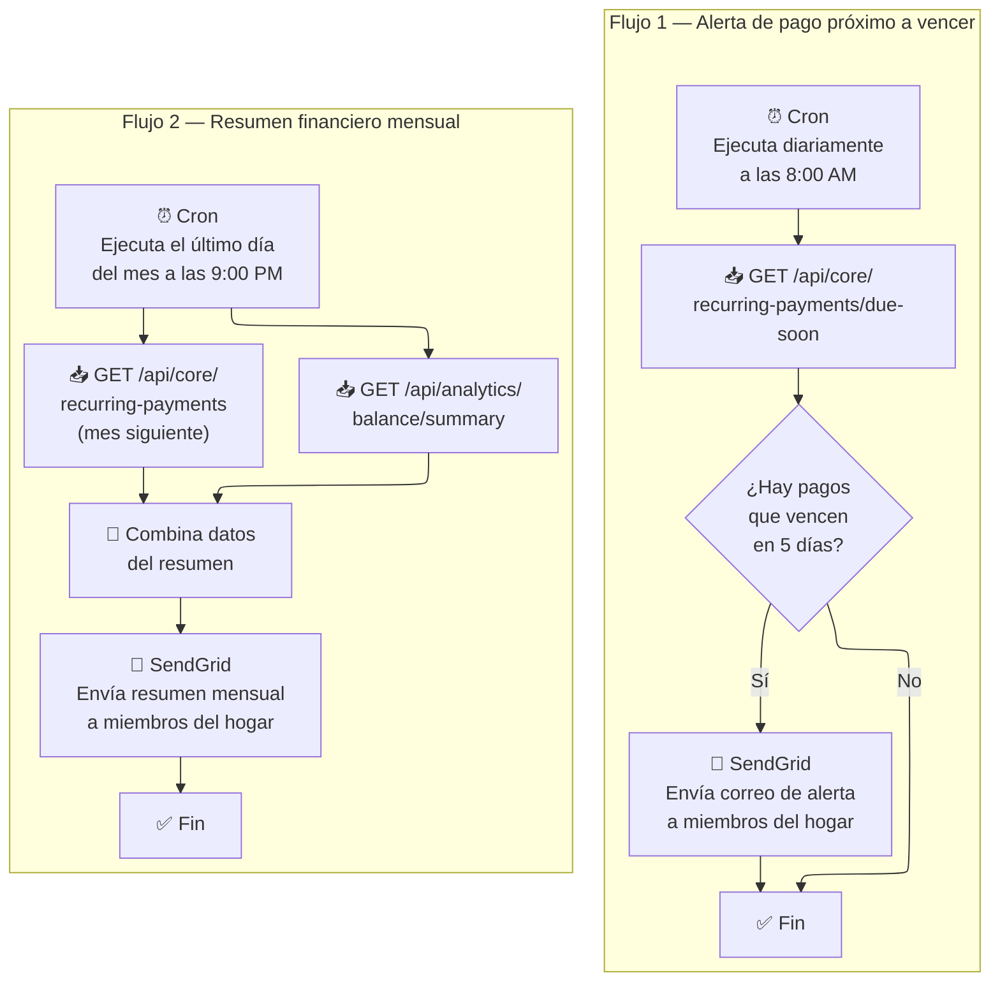
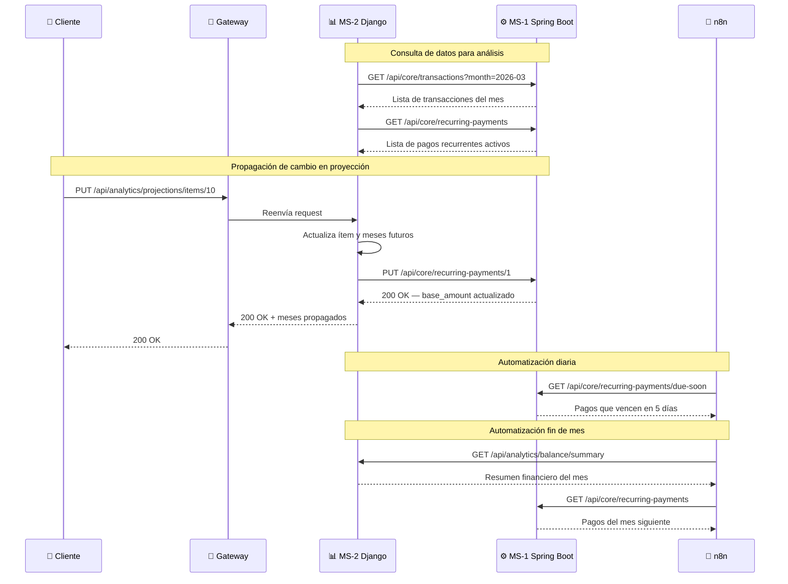

# Arquitectura general — FinanzasHogar

# API Gateway — FinanzasHogar

# MS-1 Spring Boot — FinanzasHogar

# MS-2 Django — FinanzasHogar

# Automatizaciones n8n — FinanzasHogar

# Comunicación entre servicios — FinanzasHogar

