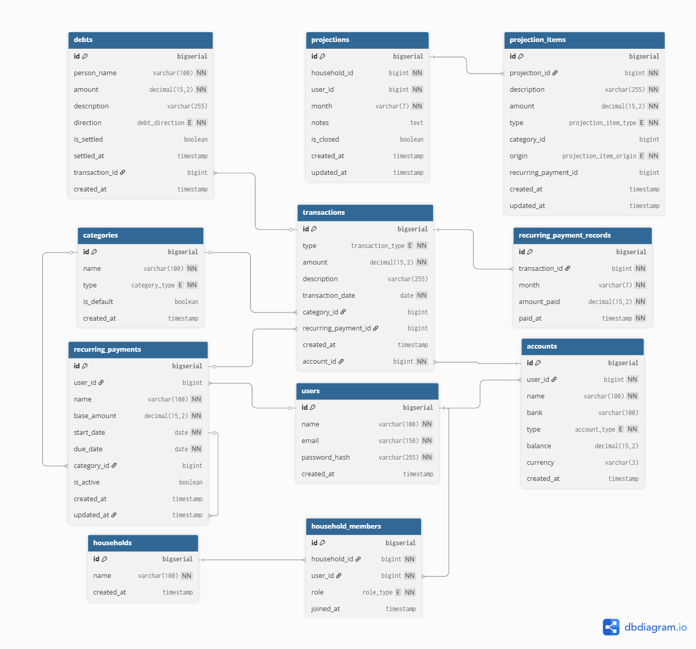

# Diccionario de datos

# Diccionario de datos — FinanzasHogar

## Enums

### role_type

| Valor    | Descripción                                                                                |
| -------- | ------------------------------------------------------------------------------------------ |
| `owner`  | Usuario que creó el hogar. Puede eliminar el hogar e invitar miembros.                     |
| `member` | Usuario invitado al hogar. Puede ver y registrar información pero no administrar el hogar. |

### account_type

| Valor     | Descripción        |
| --------- | ------------------ |
| `savings` | Cuenta de ahorros. |
| `credit`  | Cuenta de crédito. |

### transaction_type

| Valor     | Descripción                     |
| --------- | ------------------------------- |
| `income`  | Entrada de dinero a una cuenta. |
| `expense` | Salida de dinero de una cuenta. |

### category_type

| Valor     | Descripción                                                       |
| --------- | ----------------------------------------------------------------- |
| `income`  | Categoría aplicable solo a ingresos. Ejemplo: salario, freelance. |
| `expense` | Categoría aplicable solo a egresos. Ejemplo: mercado, transporte. |

### debt_direction

| Valor      | Descripción                               |
| ---------- | ----------------------------------------- |
| `i_owe`    | El usuario le debe dinero a otra persona. |
| `they_owe` | Otra persona le debe dinero al usuario.   |

### projection_item_type

| Valor     | Descripción                                        |
| --------- | -------------------------------------------------- |
| `income`  | Ingreso esperado dentro de una proyección mensual. |
| `expense` | Egreso esperado dentro de una proyección mensual.  |

### projection_item_origin

| Valor       | Descripción                                                   |
| ----------- | ------------------------------------------------------------- |
| `manual`    | Ítem ingresado manualmente por el usuario.                    |
| `recurring` | Ítem copiado automáticamente desde un pago recurrente activo. |

---

## Tablas MS-1 — Spring Boot

### users

Almacena los usuarios registrados en el sistema.

| Campo           | Tipo         | Restricciones    | Descripción                                                         |
| --------------- | ------------ | ---------------- | ------------------------------------------------------------------- |
| `id`            | bigserial    | PK               | Identificador único autoincremental.                                |
| `name`          | varchar(100) | not null         | Nombre completo del usuario.                                        |
| `email`         | varchar(150) | unique, not null | Correo electrónico. Se usa para autenticación e invitaciones.       |
| `password_hash` | varchar(255) | not null         | Contraseña encriptada con bcrypt. Nunca se almacena en texto plano. |
| `created_at`    | timestamp    | default now()    | Fecha y hora de registro del usuario.                               |

---

### households

Representa un hogar compartido entre dos personas.

| Campo        | Tipo         | Restricciones | Descripción                                 |
| ------------ | ------------ | ------------- | ------------------------------------------- |
| `id`         | bigserial    | PK            | Identificador único autoincremental.        |
| `name`       | varchar(100) | not null      | Nombre del hogar. Ejemplo: "Casa Martínez". |
| `created_at` | timestamp    | default now() | Fecha y hora de creación del hogar.         |

---

### household_members

Relación entre usuarios y hogares. Un usuario pertenece a un hogar con un rol específico.

| Campo          | Tipo      | Restricciones                | Descripción                                      |
| -------------- | --------- | ---------------------------- | ------------------------------------------------ |
| `id`           | bigserial | PK                           | Identificador único autoincremental.             |
| `household_id` | bigint    | FK → households.id, not null | Hogar al que pertenece el miembro.               |
| `user_id`      | bigint    | FK → users.id, not null      | Usuario miembro del hogar.                       |
| `role`         | role_type | not null                     | Rol del usuario en el hogar: `owner` o `member`. |
| `joined_at`    | timestamp | default now()                | Fecha y hora en que el usuario se unió al hogar. |

---

### accounts

Cuentas bancarias registradas por un usuario. No se conectan a bancos reales.

| Campo        | Tipo          | Restricciones           | Descripción                                                                                       |
| ------------ | ------------- | ----------------------- | ------------------------------------------------------------------------------------------------- |
| `id`         | bigserial     | PK                      | Identificador único autoincremental.                                                              |
| `user_id`    | bigint        | FK → users.id, not null | Usuario dueño de la cuenta.                                                                       |
| `name`       | varchar(100)  | not null                | Nombre descriptivo de la cuenta. Ejemplo: "Bancolombia ahorros".                                  |
| `bank`       | varchar(100)  | nullable                | Nombre del banco. Ejemplo: "Bancolombia", "Nequi".                                                |
| `type`       | account_type  | not null                | Tipo de cuenta: `savings` (ahorros) o `credit` (crédito).                                         |
| `balance`    | decimal(15,2) | default 0               | Saldo actual de la cuenta. Se actualiza con cada transacción.                                     |
| `currency`   | varchar(3)    | default 'COP'           | Moneda de la cuenta en formato ISO 4217. Por defecto pesos colombianos. Escalable a multi-moneda. |
| `created_at` | timestamp     | default now()           | Fecha y hora de registro de la cuenta.                                                            |

---

### categories

Categorías para clasificar ingresos y egresos. Pueden ser predefinidas del sistema o creadas por el hogar.

| Campo        | Tipo          | Restricciones | Descripción                                                                                                                          |
| ------------ | ------------- | ------------- | ------------------------------------------------------------------------------------------------------------------------------------ |
| `id`         | bigserial     | PK            | Identificador único autoincremental.                                                                                                 |
| `name`       | varchar(100)  | not null      | Nombre de la categoría. Ejemplo: "Mercado", "Salario", "Transporte".                                                                 |
| `type`       | category_type | not null      | Indica si aplica a ingresos (`income`) o egresos (`expense`).                                                                        |
| `is_default` | boolean       | default false | `true` si es una categoría predefinida del sistema disponible para todos los hogares. `false` si fue creada por un hogar específico. |
| `created_at` | timestamp     | default now() | Fecha y hora de creación de la categoría.                                                                                            |

---

### transactions

Registro de todos los movimientos de dinero (ingresos y egresos) en las cuentas.

| Campo                  | Tipo             | Restricciones                        | Descripción                                                                              |
| ---------------------- | ---------------- | ------------------------------------ | ---------------------------------------------------------------------------------------- |
| `id`                   | bigserial        | PK                                   | Identificador único autoincremental.                                                     |
| `account_id`           | bigint           | FK → accounts.id, not null           | Cuenta sobre la que se realiza el movimiento.                                            |
| `type`                 | transaction_type | not null                             | Tipo de movimiento: `income` (ingreso) o `expense` (egreso).                             |
| `amount`               | decimal(15,2)    | not null                             | Monto del movimiento. Siempre positivo. El tipo determina si suma o resta al saldo.      |
| `description`          | varchar(255)     | nullable                             | Descripción libre del movimiento. Puede quedar vacío si el usuario no sabe en qué gastó. |
| `transaction_date`     | date             | not null                             | Fecha en que ocurrió el movimiento. Puede ser pasada, presente o futura.                 |
| `category_id`          | bigint           | FK → categories.id, nullable         | Categoría del movimiento. Opcional — si no se especifica queda sin categoría.            |
| `recurring_payment_id` | bigint           | FK → recurring_payments.id, nullable | Pago recurrente que originó este movimiento. Nulo si fue registrado manualmente.         |
| `created_at`           | timestamp        | default now()                        | Fecha y hora en que se registró el movimiento en el sistema.                             |

---

### recurring_payments

Pagos que se repiten cada mes con una fecha límite de pago.

| Campo         | Tipo          | Restricciones                | Descripción                                                                                                                                                                         |
| ------------- | ------------- | ---------------------------- | ----------------------------------------------------------------------------------------------------------------------------------------------------------------------------------- |
| `id`          | bigserial     | PK                           | Identificador único autoincremental.                                                                                                                                                |
| `user_id`     | bigint        | FK → users.id, not null      | Usuario responsable del pago.                                                                                                                                                       |
| `name`        | varchar(100)  | not null                     | Nombre del pago. Ejemplo: "Arriendo", "Netflix", "Gimnasio".                                                                                                                        |
| `base_amount` | decimal(15,2) | not null                     | Monto base esperado del pago. Puede ajustarse al momento de pagar. Se actualiza si se propaga un cambio desde proyección.                                                           |
| `start_date`  | date          | not null                     | Fecha desde la que el pago está activo.                                                                                                                                             |
| `due_date`    | date          | not null                     | Fecha límite del pago en el mes actual. Cuando el pago se renueva al mes siguiente esta fecha se actualiza. El sistema genera alerta 5 días antes si el pago no ha sido registrado. |
| `category_id` | bigint        | FK → categories.id, nullable | Categoría del pago. Ejemplo: "Servicios", "Entretenimiento".                                                                                                                        |
| `is_active`   | boolean       | default true                 | `false` cuando el pago recurrente se cancela y ya no debe aparecer en proyecciones ni generar alertas.                                                                              |
| `created_at`  | timestamp     | default now()                | Fecha y hora de creación del pago recurrente.                                                                                                                                       |
| `updated_at`  | timestamp     | default now()                | Fecha y hora de la última modificación. Se actualiza cuando se propaga un cambio desde una proyección.                                                                              |

---

### recurring_payment_records

Registro histórico de cada vez que se pagó un pago recurrente en un mes específico.

| Campo            | Tipo          | Restricciones                  | Descripción                                                                            |
| ---------------- | ------------- | ------------------------------ | -------------------------------------------------------------------------------------- |
| `id`             | bigserial     | PK                             | Identificador único autoincremental.                                                   |
| `transaction_id` | bigint        | FK → transactions.id, not null | Transacción generada al marcar el pago como pagado.                                    |
| `month`          | varchar(7)    | not null                       | Mes al que corresponde el pago en formato `YYYY-MM`. Ejemplo: `2026-04`.               |
| `amount_paid`    | decimal(15,2) | not null                       | Monto real pagado en ese mes. Puede diferir del `base_amount` si el usuario lo ajustó. |
| `paid_at`        | timestamp     | not null                       | Fecha y hora exacta en que se registró el pago.                                        |

---

### debts

Registro de deudas entre el usuario y otras personas.

| Campo            | Tipo           | Restricciones                  | Descripción                                                                              |
| ---------------- | -------------- | ------------------------------ | ---------------------------------------------------------------------------------------- |
| `id`             | bigserial      | PK                             | Identificador único autoincremental.                                                     |
| `person_name`    | varchar(100)   | not null                       | Nombre de la persona involucrada en la deuda. Puede ser externo al sistema.              |
| `amount`         | decimal(15,2)  | not null                       | Monto de la deuda.                                                                       |
| `description`    | varchar(255)   | nullable                       | Descripción del motivo de la deuda. Ejemplo: "Mercado del 15 de marzo".                  |
| `direction`      | debt_direction | not null                       | Dirección de la deuda: `i_owe` (yo debo) o `they_owe` (me deben).                        |
| `is_settled`     | boolean        | default false                  | `true` cuando la deuda fue saldada.                                                      |
| `settled_at`     | timestamp      | nullable                       | Fecha y hora en que se saldó la deuda. Nulo si aún está pendiente.                       |
| `transaction_id` | bigint         | FK → transactions.id, nullable | Transacción generada al saldar la deuda. Permite rastrear de qué cuenta salió el dinero. |
| `created_at`     | timestamp      | default now()                  | Fecha y hora en que se registró la deuda.                                                |

---

## Tablas MS-2 — Django

### projections

Proyección financiera de un hogar para un mes específico.

| Campo          | Tipo       | Restricciones | Descripción                                                                                                                    |
| -------------- | ---------- | ------------- | ------------------------------------------------------------------------------------------------------------------------------ |
| `id`           | bigserial  | PK            | Identificador único autoincremental.                                                                                           |
| `household_id` | bigint     | not null      | Referencia lógica al hogar en MS-1. No es FK real porque las BDs son independientes.                                           |
| `user_id`      | bigint     | not null      | Referencia lógica al usuario que creó la proyección en MS-1.                                                                   |
| `month`        | varchar(7) | not null      | Mes proyectado en formato `YYYY-MM`. Ejemplo: `2026-05`.                                                                       |
| `notes`        | text       | nullable      | Notas libres del usuario sobre la proyección del mes.                                                                          |
| `is_closed`    | boolean    | default false | `true` cuando el mes ya pasó. Una proyección cerrada no se modifica y sirve únicamente para comparar contra la ejecución real. |
| `created_at`   | timestamp  | default now() | Fecha y hora de creación de la proyección.                                                                                     |
| `updated_at`   | timestamp  | default now() | Fecha y hora de la última modificación.                                                                                        |

---

### projection_items

Ítems individuales que componen una proyección mensual.

| Campo                  | Tipo                   | Restricciones                 | Descripción                                                                                                                                                                                         |
| ---------------------- | ---------------------- | ----------------------------- | --------------------------------------------------------------------------------------------------------------------------------------------------------------------------------------------------- |
| `id`                   | bigserial              | PK                            | Identificador único autoincremental.                                                                                                                                                                |
| `projection_id`        | bigint                 | FK → projections.id, not null | Proyección mensual a la que pertenece este ítem.                                                                                                                                                    |
| `description`          | varchar(255)           | not null                      | Descripción del ingreso o egreso proyectado. Ejemplo: "Salario", "Arriendo".                                                                                                                        |
| `amount`               | decimal(15,2)          | not null                      | Monto esperado para este ítem en el mes proyectado.                                                                                                                                                 |
| `type`                 | projection_item_type   | not null                      | Tipo: `income` (ingreso esperado) o `expense` (egreso esperado).                                                                                                                                    |
| `category_id`          | bigint                 | nullable                      | Referencia lógica a la categoría en MS-1. Permite comparar proyección vs ejecución por rubro.                                                                                                       |
| `origin`               | projection_item_origin | not null                      | Indica si el ítem fue ingresado manualmente (`manual`) o copiado desde un pago recurrente (`recurring`).                                                                                            |
| `recurring_payment_id` | bigint                 | nullable                      | Referencia lógica al pago recurrente en MS-1 que originó este ítem. Usado para propagar cambios de monto hacia meses futuros y hacia el `base_amount` del recurrente. Nulo si `origin` es `manual`. |
| `created_at`           | timestamp              | default now()                 | Fecha y hora de creación del ítem.                                                                                                                                                                  |
| `updated_at`           | timestamp              | default now()                 | Fecha y hora de la última modificación. Se actualiza cuando se propaga un cambio desde otro mes.                                                                                                    |

# Modelo de datos

